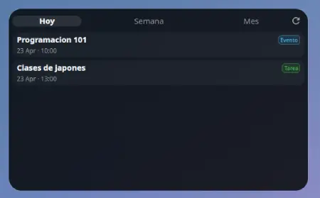
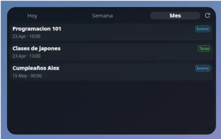
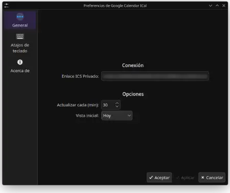

# 📅 Google Calendar ICal Widget


Un widget de escritorio elegante, minimalista y de solo lectura para **KDE Plasma** que te permite visualizar tus eventos de **Google Calendar** (o cualquier calendario compatible con ICS) directamente en tu panel o escritorio.

---

## 🚀 Características

- **Vistas Dinámicas**: Cambia rápidamente entre vista de **Hoy**, **Semana** o **Mes**.
- **Diseño Moderno**: Estética *glassmorphism* que se integra perfectamente con el escritorio Plasma.
- **Detección de Tipos**: Diferencia visualmente entre "Eventos" y "Tareas" (mediante colores inteligentes).
- **Actualización Automática**: Se mantiene sincronizado con tu calendario cada 30 minutos (configurable).
- **Ligero**: Sin dependencias pesadas, utiliza QML puro y un parser de JS optimizado.
- **Manual/Auto Refresh**: Botón de actualización manual integrado para cambios inmediatos.

---

## 📸 Capturas de Pantalla

> [!TIP]
> El diseño está optimizado para KDE Plasma 6 y se adapta automáticamente a los colores de tu tema.

<p align="center">
  
  
  
</p>

---

## 🛠️ Instalación

### Método 1: Manual (Recomendado para desarrollo)

1. **Clona el repositorio en tu carpeta de widgets:**
   ```bash
   git clone https://github.com/zan101x/com.zan101.calendar_ical.git ~/.local/share/plasma/plasmoids/com.zan101.calendar_ical
   ```

2. **Refresca Plasma o reinicia sesión:**
   ```bash
   plasmashell --replace &
   ```

3. **Añade el widget:**
   Haz clic derecho en tu escritorio o panel -> **Añadir widgets...** -> Busca **"Google Calendar ICal"**.

---

## ⚙️ Configuración

Para que el widget funcione, necesitas obtener la **Dirección secreta en formato iCal** de tu calendario:

1. Ve a **Google Calendar** en tu navegador.
2. En la lista de calendarios a la izquierda, haz clic en los tres puntos `⋮` del calendario que quieras usar -> **Configuración y uso compartido**.
3. Baja hasta la sección **Integrar el calendario**.
4. Copia la URL de **Dirección secreta en formato iCal**.
5. En el widget, haz clic derecho -> **Configurar Google Calendar ICal**.
6. Pega la URL en el campo **ICS URL**.

---

## 👤 Autor

Desarrollado con ❤️ por **Zan101**.

---
*Si este widget te ayuda a organizar mejor tu día, ¡dale una ⭐️ al repositorio!*
